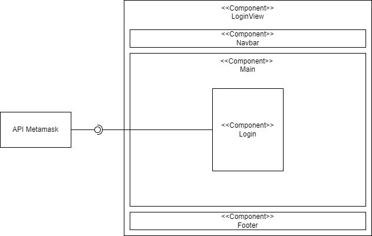
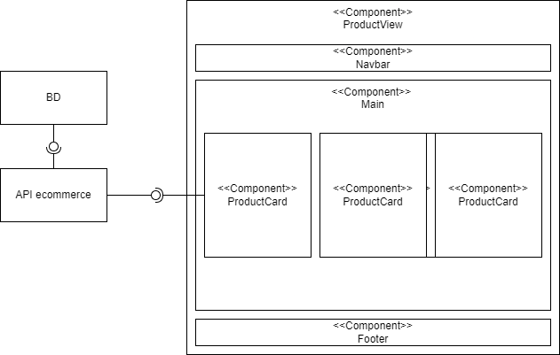
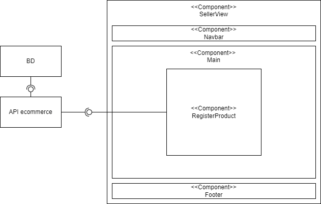
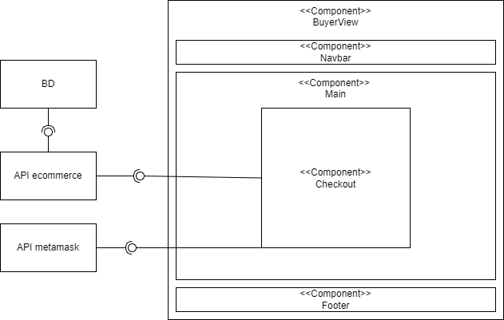

# Project 0

This project is for ITRM

# TODO
- [x] Configurar el espacio de trabajo
- [x] Realizar el diagrama de componentes
- [x] Crear el proyecto en react
- [x] Crear nuestro primer componente (funcional y en clase)
- [x] Agregar un evento a nuestro primer componente (funcional y en clase)
- [x] Manejo de estado en cada compponente creado

# Component Diagram

